# Qinnovate ↔ Mindloft Research Lifecycle

> **Visual workflow documenting the continuous cycle between standards development and product implementation**

```mermaid
graph TB
    subgraph MINDLOFT["🛠️ MINDLOFT (Product Company)"]
        A[Research & Exploration<br/>mindloft/drafts]
        B[Field Notes & Equations<br/>QIF-FIELD-NOTES.md<br/>qif-lab testing]
        C[Validation & Canonicalization<br/>QIF-TRUTH.md]
        D[Product Implementation<br/>mindloft/main<br/>Mindloft Core, SDK, Cloud]
    end

    subgraph QINNOVATE["🏛️ QINNOVATE (Standards Body)"]
        E[Standards Publication<br/>qif-framework/<br/>oni-framework/]
        F[Governance & Ethics<br/>governance/]
        G[Committee Review<br/>Academic collaboration]
        H[Public Dissemination<br/>qinnovate.com<br/>Research papers]
    end

    A -->|Experiments &<br/>Prototypes| B
    B -->|Validate findings| C
    C -->|Ready for<br/>standardization| E
    E -->|Ethics alignment| F
    F -->|Peer review| G
    G -->|Publish| H
    H -->|Implement<br/>in products| D
    D -->|Real-world<br/>feedback| A

    style MINDLOFT fill:#f0f9ff,stroke:#3b82f6,stroke-width:3px
    style QINNOVATE fill:#fef3c7,stroke:#f59e0b,stroke-width:3px
    style A fill:#dbeafe,stroke:#3b82f6
    style B fill:#dbeafe,stroke:#3b82f6
    style C fill:#dbeafe,stroke:#3b82f6
    style D fill:#dbeafe,stroke:#3b82f6
    style E fill:#fef08a,stroke:#f59e0b
    style F fill:#fef08a,stroke:#f59e0b
    style G fill:#fef08a,stroke:#f59e0b
    style H fill:#fef08a,stroke:#f59e0b
```



---

## Lifecycle Phases

### Phase 1: Research & Exploration (Mindloft/drafts)
**Location:** `mindloft/drafts/ai-working/`

- Free-form experimentation
- QIF equation development
- Theoretical exploration
- Early prototypes

**Key Files:**
- `QIF-FIELD-NOTES.md` — Research journal
- `QI-EQUATION-RESEARCH.md` — Equation candidates
- `qif-lab/` — Testing & validation

---

### Phase 2: Validation & Canonicalization (Mindloft/drafts)
**Location:** `mindloft/drafts/ai-working/QIF-TRUTH.md`

- Peer validation
- Equation testing
- Literature review
- Source of truth updates

**Exit Criteria:**
- ✅ Equations tested in qif-lab
- ✅ Academic sources cited
- ✅ No contradictions with physics
- ✅ Ready for standardization

---

### Phase 3: Standards Publication (Qinnovate)
**Location:** `qinnovate/qif-framework/`, `qinnovate/oni-framework/`

- Framework documentation
- Technical specifications
- Architecture definitions
- Public standards

**Governance:** Apache 2.0 license, vendor-neutral

---

### Phase 4: Ethics & Governance (Qinnovate)
**Location:** `qinnovate/governance/`

- Neuroethics alignment
- UNESCO compliance
- Regulatory frameworks
- Transparency protocols

**Standards:**
- GDPR, HIPAA compliance
- FDA alignment
- Informed consent frameworks

---

### Phase 5: Committee Review (Qinnovate)

- Academic collaboration
- Peer review
- Standards body validation
- Partnership alignment

**Stakeholders:**
- Universities
- IEEE, NIST, ISO
- Industry partners
- Regulatory bodies

---

### Phase 6: Public Dissemination (Qinnovate)
**Location:** `qinnovate.com`, research publications

- Website publication
- Research papers
- Conference presentations
- Open standards advocacy

**Channels:**
- GitHub (open source)
- Academic journals
- Industry conferences

---

### Phase 7: Product Implementation (Mindloft/main)
**Location:** `mindloft/main/`, `mindloft.org`

- Mindloft Core engine
- Mindloft SDK
- Mindloft Cloud platform
- Commercial products

**License:** Proprietary (products), Apache 2.0 (frameworks)

---

### Phase 8: Real-World Feedback Loop

- User feedback
- Security incident data
- Performance metrics
- New threat discovery

**Feeds back into Phase 1** → Research & Exploration

---

## Key Separation Points

| Aspect | Mindloft | Qinnovate |
|--------|----------|-----------|
| **Role** | Product company | Standards body |
| **Focus** | Implementation & innovation | Research & governance |
| **Output** | Products (Core, SDK, Cloud) | Open standards (QIF, ONI) |
| **License** | Proprietary | Apache 2.0 |
| **Audience** | Developers, end users | Academia, industry, regulators |
| **Website** | mindloft.org | qinnovate.com |
| **Analogy** | Chrome (products) | W3C (standards) |

---

## Repository Structure

```
mindloft/
├── main/              → Products, GitHub Pages, MAIN/ archive
└── drafts/            → Research-in-progress, QIF-TRUTH.md

qinnovate/
├── qif-framework/     → Published QIF standards
├── oni-framework/     → Published ONI standards
├── governance/        → Neuroethics & compliance
└── shared/            → Classical↔Quantum bridge
```

---

## The Continuous Cycle

```
Research (Mindloft) → Validation (Mindloft) →
Standards (Qinnovate) → Governance (Qinnovate) →
Review (Qinnovate) → Publication (Qinnovate) →
Implementation (Mindloft) → Feedback (Mindloft) →
Research (Mindloft) → ...
```

**Duration:** Weeks to months per cycle, depending on complexity

**Key Principle:** Standards evolve from real implementations. Products implement validated standards.

---

*Created: 2026-02-05*
*Purpose: Document the research lifecycle between Mindloft (products) and Qinnovate (standards)*
